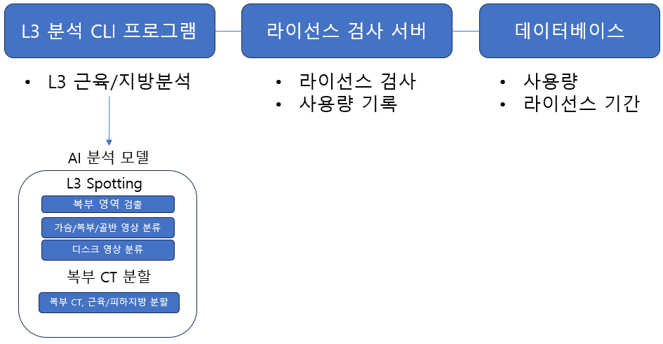
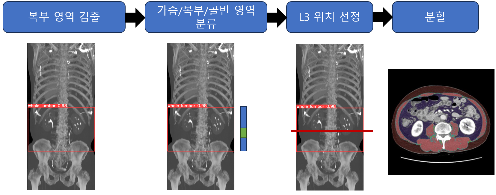
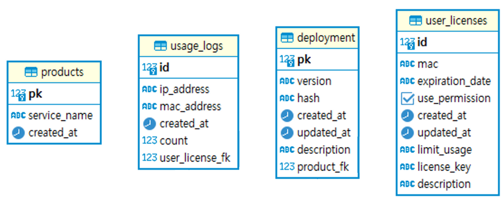
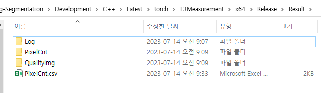
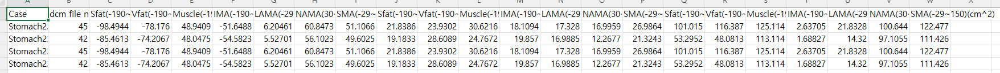
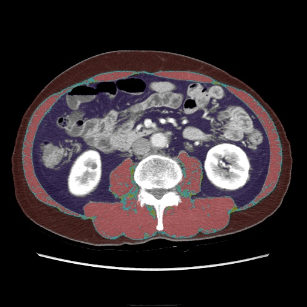
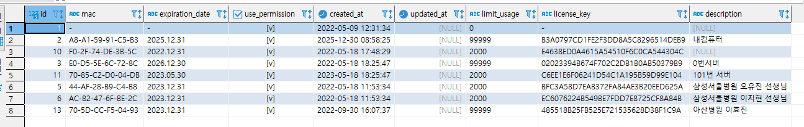
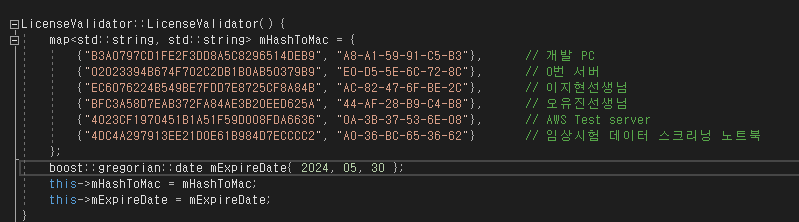

# 1. 개요

-   다수의 복부 CT Series 데이터에 대해 일괄적으로 L3 위치의 복부 근육/지방 영역을 분석
-   특정 위치에 저장된 DICOM 폴더를 스캔하여 일괄 분석 실행

# 2. 개발환경

-   CLI 분석 프로그램

| 언어    | C++                |
| ------- | ------------------ |
| IDE     | Visual studio 2019 |
| OS      | Windows 10         |
| AI Lib. | Torchscript        |

-   라이센스 서버
    -   사용 로그 저장(IP 포함)
    -   MAC 주소를 이용해 사용가능한 서버인지 검사

| 클라우드 이용 | AWS          |
| ------------- | ------------ |
| 서버사양      | T2.large     |
| 프레임워크    | Node express |
| 언어          | Typescript   |

# 3. 프로그램 세부

## 3.1 시스템 구성도



## 3.2 L3 분석 프로세스



## 3.3 DB schema



# 3. 프로그램 실행방법

## 3.1 분석프로그램

### 1. 분석/저장 폴더 경로

-   **‘config.yaml’** 파일을 연 후, 아래 두 속성 값을 수정
    -   **input_path:** 분석 데이터가 저장된 폴더 경로 설정
    -   **output_path:** 분석 결과를 저장할 폴더 경로 설정
    -   **save_extra_l3_data:** 분할 마스크 저장 여부 설정
        → 상세한 속성 정보는 다음 표에 안내된 속성 값을 참고

| 속성이름           | 타입    | 샘플값   | 설명                                                      |
| ------------------ | ------- | -------- | --------------------------------------------------------- |
| input_path         | string  | ./input  | 분석 대상 폴더 경로                                       |
| output_path        | string  | ./output | 분석 결과 저장 경로                                       |
| batchsize          | number  | 32       | AI 추론, 배치 크기(분석환경의 GPU 사용량을 확인하여 조절) |
| save_extra_l3_data | boolean | true     | 분석 시, 분할 마스크 저장 여부 설정                       |

## 2. 실행

-   L3Analyzer.exe 실행

## 3.2 라이선스 프로그램

-   소스코드 루트 폴더(package.json 파일이 위치한 폴더) 에서 아래 명령 수행

```bash
npm run start
```

# 4. 실행결과

1. SFat/VFat/Muscle(IMA,LAMA,NAMA,SMA)에 대한 면적, HU 평균, 표준편차 정보 저장

    ⇒ PixelCnt.csv에 저장





1. 원본+분할영역 오버레이 영상



# 5. 개발 관련 인수인계 사항

## 5.1 라이센스 서버 운영

-   라이센스 검사 서버

| 클라우드 이용 | AWS                           |
| ------------- | ----------------------------- |
| 서버사양      | EC2, T2.large                 |
| 폴더위치      | /home/ec2-user/license-server |
| 접근방법      | AWS 콘솔 or SSH 연결          |
| 계정이름      | ec2-user                      |
| 서버 주소     | 13.209.220.151                |

-   통신 인증 키

[aws-server-key.zip](https://drive.google.com/file/d/1X0pi2gkoJZEmetmaC-2hWfSthaBLlmXo/view?usp=drive_link)

-   데이터베이스 서버

| 클라우드 이용 | AWS                                                        |
| ------------- | ---------------------------------------------------------- |
| 서비스        | RDS, t2.micro                                              |
| DBMS          | PostgresQL                                                 |
| 접근방법      | DBeaver, (이외, PostgresQL 관련 도구)                      |
| 접근 주소     | iaid-license.cm6bwpc41pbg.ap-northeast-2.rds.amazonaws.com |
| 계정이름      | iaid_license                                               |
| 계정비밀번호  | qlalfqjsgh1!                                               |

## 5.2 프로그램 라이선스 설정

### 5.2.1 클라이언트가 인터넷에 연결 가능한 경우

1. 사용자의 랜카드 Mac address 획득
2. mac address를 MD5 형식으로 변환
    1. google에 md5 변환 online 툴
3. 라이센스 데이터 베이스에 접속
4. user_licenses Table 열기
5. 테이블에 1/2번에서 획득한 정보를 이용해 새 레코드 입력



1. 코드에서 라이센스 식별 모드 변경(원격지서버이용)
    1. ValidationMode::Remote 옵션을 사용하여 LiceseValidator::setMode 메서드를 호출

```cpp
// 3. License 유효성 검증
	LicenseValidator licenseValidator;
	licenseValidator.setMode(ValidationMode::Remote);
	licenseValidator.setServerBaseUrl(configList.licenseServerBaseUrl);
```

### 5.2.2 클라이언트가 인터넷에 연결 안되는 경우

-   아래 코드에서 클라이언트 MAC 주소와 MAC 주소에 MD5 해싱을 적용한값을 mHashToMac 변수에 추가
-   mExpireData에 사용 만료일을 지정



1. 코드에서 라이센스 식별 모드 변경(In-memory에 설정된 라이센스 정보 값 이용)

    ValidationMode::Local 옵션을 사용하여 LiceseValidator::setMode 메서드를 호출

```cpp
// 3. License 유효성 검증
	LicenseValidator licenseValidator;
	licenseValidator.setMode(ValidationMode::Local); // <- 요기
	licenseValidator.setServerBaseUrl(configList.licenseServerBaseUrl);
```

## 5.3 사용량 추적

1. 라이센스 데이터 베이스에 접속
2. user_licenses Table 열기
3. 추적 대상 사용자의 id (primary key) 값 획득
4. 아래 SQL 쿼리를 실행하여 사용량 확인

```SQL
select count(*) from license.usage_logs ul where user_license_fk = 1
```

## 5.2 모델 변경

-   본 프로그램에서 사용되는 모델은 외부로 모델파일이 직접 노출되는 문제가 존재
-   모델의 노출 수준을 낮추기위해 아래 과정을 수행하여 모델파일을 숨김


-   변환방법
    : torchscript 변환까지는 torch 내장함수에서 지원하는 함수를 사용

    -   Pytorch 모델 파일 준비
    -   Torchscript 변환
    -   Obj 변환

        -   mingw-w64 설치
        -   다음 명령어를 실행하여 모델파일 → obj(목적파일)변환

        ```bash
        objcopy --input-target binary --output-target pe-x86-64 --binary-architecture i386 모델파일.pth 모델파일.obj
        ```

        -   아래 명령어를 통해 외부 심볼파일 확인

        ```bash
        objdump -t 모델파일.obj
        ```

        -   C 에서 접근할 수 있도록 외부 심볼 정의

        ```cpp
        #pragma once

        extern "C" unsigned char _binary_traced_step4_model_pt_start[];
        extern "C" unsigned char _binary_traced_step4_model_pt_end[];
        extern "C" unsigned char _binary_traced_step4_model_pt_size[];

        int binary_step4_model_size = _binary_traced_step4_model_pt_end - \
        _binary_traced_step4_model_pt_start;
        ```

#### [개발환경구성 - L3 일괄 분석 프로그램-CLI](./build_env.md)
